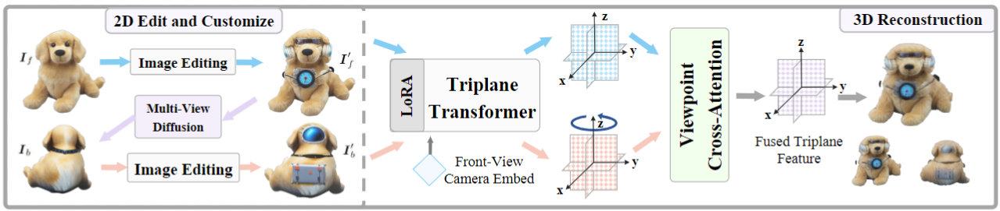

#  Tailor3D: Customized 3D Assets Editing and Generation with Dual-Side Images

<div style="text-align: center;">
  <p class="title is-5 mt-2 authors"> 
    <a href="https://scholar.google.com/citations?user=kwVLpo8AAAAJ&hl=en/" target="_blank">Zhangyang Qi</a><sup>1,5*</sup>, 
    <a href="https://yhyang-myron.github.io/" target="_blank">Yunhan Yang</a><sup>1*</sup>, 
    <a href="https://github.com/kszpxxzmc/" target="_blank">Mengchen Zhang</a><sup>2,5</sup>, 
    <a href="https://github.com/Cooperx521" target="_blank">Long Xing</a><sup>3,5</sup>, 
    <a href="https://xywu.me/" target="_blank">Xiaoyang Wu</a><sup>1</sup>, 
    <a href="https://wutong16.github.io/" target="_blank">Tong Wu</a><sup>4,5</sup>,
    <a href="http://dahua.me/" target="_blank">Dahua Lin</a><sup>4,5</sup>,
    <a href="https://xh-liu.github.io/" target="_blank">Xihui Liu</a><sup>1</sup>, 
    <a href="https://myownskyw7.github.io/" target="_blank">Jiaqi Wang</a><sup>5</sup>&#9993;,
    <a href="https://hszhao.github.io/" target="_blank">Hengshuang Zhao</a><sup>1</sup>&#9993;
  </p>
</div>

<div style="text-align: center;">
    <!-- contribution -->
    <p class="subtitle is-5" style="font-size: 1.0em; text-align: center;">
        <sup>*</sup> Equation Contribution,
        <sup>&#9993;</sup> Corresponding Authors,
    </p>
</div>

<div style="text-align: center;">
  <!-- affiliations -->
  <p class="subtitle is-5" style="font-size: 1.0em; text-align: center;"> 
    <sup>1</sup> The University of Hong Kong, 
    <sup>2</sup> Zhejiang University, 
    <sup>3</sup> University of Science and Technology of China,
    <br>
    <sup>4</sup> The Chinese University of Hong Kong,
    <sup>5</sup> Shanghai AI Laboratory,
  </p>
</div>

<p align="center">
  <a href="http://arxiv.org/abs/2407.06191" target='_**blank**'>
    
  </a> 
  <a href="https://tailor3d-2024.github.io/" target='_blank'>
    
  </a>
  <a href="https://huggingface.co/spaces/alexzyqi/Tailor3D" target='_blank'>
    
  </a>
  <a href="https://youtu.be/z9w5CN8mUJQ" target='_blank'>
    
  </a>
</p>

<video src="assets/github_page/video_teaser.mp4" autoplay="autoplay" muted="muted" loop="loop">
</video>

## 🔥 News

- [2024.07.03] We release the [arxiv paper](https://arxiv.org/abs/2407.06191), [code v1.0](https://github.com/Qi-Zhangyang/Tailor3D), [project page](https://tailor3d-2024.github.io/), [model weight](https://huggingface.co/alexzyqi/Tailor3D-Base-1.0) and the [dataset card](https://huggingface.co/datasets/alexzyqi/Tailor3D-Gobjaverse-LVIS) of **Tailor3D**. Note that in v1.0, the fusion front and back triplane way is the **conv2d**.

## 🏠 Overview (Pipeline and Video)

### Pipeline


We propose Tailor3D, a novel pipeline creating customized 3D assets from editable dual-side images and feed-forward reconstruction methods. This approach mimics a tailor's local object changes and style transfers:

1) Use image editing methods to edit the front-view image. The front-view image can be provided or generated from text.
2) Use multi-view diffusion techniques (e.g., Zero-1-to-3) to generate the back view of the object.
3) Use image editing methods to edit the back-view image.
4) Use our proposed Dual-sided LRM (large reconstruction model) to seamlessly combine front and back images and get the customized 3D asset.

Each step takes only a few seconds, allowing users to interactively obtain the 3D objects they desire. Experimental results show Tailor3D's effectiveness in 3D generative fill and style transfer, providing an efficient solution for 3D asset editing.

### Tutorial Videos
<video src="assets/github_page/video_teaser.mp4" controls loop>
</video>


## 🔧 Setup

### Installation
```
conda create -n tailor3d python=3.11
conda activate tailor3d

conda install pytorch==2.2.2 torchvision==0.17.2 torchaudio==2.2.2 pytorch-cuda=11.8 -c pytorch -c nvidia

pip install -r requirements.txt
```

## 🚀 Inference

### 1. Pretrained Models

Model weights are released on [Hugging Face](https://huggingface.co/alexzyqi) and weights will be downloaded automatically when you run the inference script for the first time.

| Model | Pretained Model | Layers | Feat. Dim | Trip. Dim. | In. Res. | Image Encoder | 
| :--- | :--- | :--- | :--- | :--- | :--- | :--- |
| [tailor3d-small-1.0](https://huggingface.co/alexzyqi/tailor3d-small-1.0) | [openlrm-mix-small-1.1](https://huggingface.co/zxhezexin/openlrm-mix-small-1.1)  | 12 | 512 | 32 | 224 | dinov2_vits14_reg | 
| [tailor3d-base-1.0](https://huggingface.co/alexzyqi/tailor3d-base-1.0) | [openlrm-mix-base-1.1](https://huggingface.co/zxhezexin/openlrm-mix-base-1.1) | 12 | 768 | 48 | 336 | dinov2_vitb14_reg |
| [tailor3d-large-1.0](https://huggingface.co/alexzyqi/tailor3d-large-1.0)| [openlrm-mix-large-1.1](https://huggingface.co/zxhezexin/openlrm-mix-large-1.1) | 16 | 1024 | 80 | 448 | dinov2_vitb14_reg |


### 2. Prepare Images
- We put some sample inputs under `assets/sample_input/demo`. Note that the folders "front" and "back" should respectively contain edited images of the object's frontal view and rear view.
- Prepare RGBA images or RGB images with white background (with some background removal tools, e.g., [Rembg](https://github.com/danielgatis/rembg), [Clipdrop](https://clipdrop.co)).

### 3. Inference

An example usage of *tatlor3d-large* is as follows:

  ```
  # Example usage
  EXPORT_VIDEO=true
  EXPORT_MESH=true
  DOUBLE_SIDED=true
  HUGGING_FACE=true

  INFER_CONFIG="./configs/all-large-2sides.yaml"
  MODEL_NAME="alexzyqi/tailor3d-large-1.0"
  PRETRAIN_MODEL_HF="zxhezexin/openlrm-mix-large-1.1"
  IMAGE_INPUT="./assets/sample_input/demo"

  python -m openlrm.launch infer.lrm --infer $INFER_CONFIG model_name=$MODEL_NAME pretrain_model_hf=$PRETRAIN_MODEL_HF image_input=$IMAGE_INPUT export_video=$EXPORT_VIDEO export_mesh=$EXPORT_MESH double_sided=$DOUBLE_SIDED inferrer.hugging_face=$HUGGING_FACE
  ```

- You may specify which form of output to generate by setting the flags `EXPORT_VIDEO=true` and `EXPORT_MESH=true`.
- When `DOUBLE_SIDED=true`, Tailor3D uses both front and back view images as input; when set to false, it degenerates to LRM.
- When `HUGGING_FACE=true`, the Hugging Face model is used for inference; if set to false, inference will be conducted to evaluate the common training process.
- `INFER_CONFIG` is the config for both training and inference, you can change to small and tiny version.
- `MODEL_NAME` corresponds to the model version specified in `INFER_CONFIG`. `PRETRAIN_MODEL_HF` corresponds to the pretrained model used in OpenLRM."

## 🏗️ Training

### 1. Data Preparation
We use gobjaverse-lvis dataset. You can get access through the [hugging face dataset card](https://huggingface.co/datasets/alexzyqi/Tailor3D-Gobjaverse-LVIS).

### 2. Accelerate Training Configuration
- `configs/accelerate-train.yaml`: a sample accelerate config file to use 8 GPUs with `bf16` mixed precision.
- `configs/accelerate-train-4gpus.yaml`: a sample accelerate config file to use 4 GPUs with `bf16` mixed precision.

### 3. Run Training
An example training usage of *tatlor3d-large* is as follows:
  ```
  # Example usage
  ACC_CONFIG="./configs/accelerate-train.yaml"
  TRAIN_CONFIG="./configs/all-large-2sides.yaml"

  accelerate launch --config_file $ACC_CONFIG -m openlrm.launch train.lrm --config $TRAIN_CONFIG
  ```
- A sample training config file is provided under `TRAIN_CONFIG`, training and inference configs are all in the same config yaml file.


## ➕ Optional: Inference on Your Custom Trained Models (From OpenLRM)

### 1. Convert your trained model to hugging face release format.
- The inference pipeline is compatible with huggingface utilities for better convenience.
- You need to convert the training checkpoint to inference models by running the following script.

  ```
  python scripts/convert_hf.py --config configs/all-large-2sides.yaml
  ```

- The converted model will be saved under `exps/releases` by default and can be used for inference following the inference.

- **Note**: In this way the **model.safetensors** have the full parameters.

| Model | Model Size | Model Size (with pretrained model) | 
| :--- | :--- | :--- | 
| [tailor3d-small-1.0](https://huggingface.co/alexzyqi/tailor3d-small-1.0) | 17.4 MB | 436 MB | 
| [tailor3d-base-1.0](https://huggingface.co/alexzyqi/tailor3d-base-1.0) | 26.8 MB | 1.0 GB | 
| [tailor3d-large-1.0](https://huggingface.co/alexzyqi/tailor3d-large-1.0)| 45 MB | 1.8 GB | 

### 2. Upload the release format to the hugging face model card.

  ```
  python scripts/upload_hub.py --model_type lrm --local_ckpt exps/releases/gobjaverse-2sides-large/0428_conv_e10/step_013340 --repo_id alexzyqi/Tailor3D-Large-1.0
  ```
Note that you should change `--local_ckpt` and `--repo_id` to your own.

## 📚 Related Work

#### 3D Object Dataset
- [**Gobjaverse**](https://github.com/modelscope/richdreamer/tree/main/dataset/gobjaverse/): This is rendered by making two complete rotations around the object in Objaverse (28K 3D Objects).
- [**LVIS**](https://arxiv.org/abs/1908.03195/): It is Large Vocabulary Instance Segmentation (LVIS) dataset which focus on objects. Gobjaverse-LVIS have 21445 objects in total.


#### Text-to-Image Tools
- [**Stable Diffusion**](https://stability.ai/), [**Midjourney**](https://www.midjourney.com/home),: Text-to-Image tools to generate the front-view image.

#### Image Editing Tools
- [**Adobe Express**](https://new.express.adobe.com/): Image generative geometry and pattern fill.
- [**InstantStyle**](https://huggingface.co/spaces/InstantX/InstantStyle): Image customized styling.
- [**ControlNet**](https://huggingface.co/spaces/hysts/ControlNet-v1-1): Image style Transfer.

#### Multi-view Diffusion Tools
- [**Stable Zero123**](https://huggingface.co/stabilityai/stable-zero123): 3D-aware Multi-view Diffusion method to generate the back-view image based on the front image.

#### 3D Feed-Forward Reconstuction Methods
- [**Large Reconstuction Model**](https://yiconghong.me/LRM/): The paper and the open source code [**OpenLRM**](https://github.com/3DTopia/OpenLRM).


## 🔗 Citation

If you find this work useful for your research, please consider citing:
```
@misc{qi2024tailor3dcustomized3dassets,
      title={Tailor3D: Customized 3D Assets Editing and Generation with Dual-Side Images}, 
      author={Zhangyang Qi and Yunhan Yang and Mengchen Zhang and Long Xing and Xiaoyang Wu and Tong Wu and Dahua Lin and Xihui Liu and Jiaqi Wang and Hengshuang Zhao},
      year={2024},
      eprint={2407.06191},
      archivePrefix={arXiv},
      primaryClass={cs.CV},
      url={https://arxiv.org/abs/2407.06191}, 
}

```

